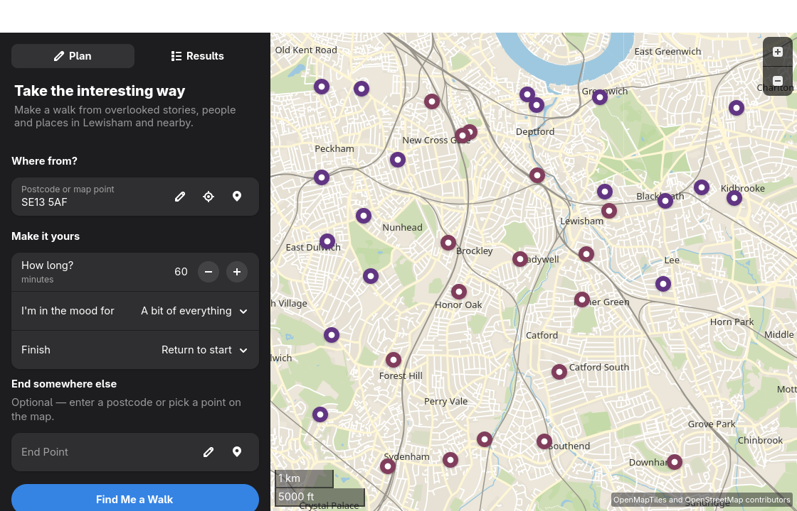

# Lewisham Walks

Lewisham Walks is a GNOME app for finding overlooked local stories and turning them into walks. It starts in Lewisham, with useful border context from Greenwich and Southwark.



Choose a postcode or a point on the map, a duration and a theme. The app selects nearby discoveries, can add a cafe or pub, requests a pedestrian route, groups its walking directions between story stops, and exports GPX. Moving the map repicks a spatially distributed set of stories from the full local corpus so the map remains useful for exploration.

The planner and bundled discoveries work locally. Keyless open services add current information:

- [Postcodes.io](https://postcodes.io/) for UK postcode lookup.
- OpenStreetMap Overpass and Nominatim for optional cafes and pubs.
- The FOSSGIS OpenStreetMap routing service for pedestrian routes.
- OpenStreetMap/OpenMapTiles data through libshumate for the map.

No account, commercial API key or secret is required. If live routing is unavailable, Lewisham Walks clearly labels and shows a local straight-line approximation.

## Status

This repository is an early public development checkpoint. There is not yet a tagged release or Flathub listing. Build the Flatpak locally to try it.

## Build and install

Install the GNOME 50 SDK and Flatpak Builder, then run:

```sh
flatpak run org.flatpak.Builder --force-clean --disable-rofiles-fuse \
  --user --install-deps-from=flathub --ccache \
  --install flatpak-build com.nedrichards.lewishamwalks.Devel.json

flatpak run com.nedrichards.lewishamwalks.Devel
```

`--disable-rofiles-fuse` is useful in restricted or containerised environments where Flatpak Builder cannot mount its normal read-only filesystem.

For a source-tree development build:

```sh
meson setup build-dir
meson compile -C build-dir
meson test -C build-dir
PYTHONPATH=src python3 -m lewisham_walks.main
```

Run all GTK/Libadwaita responsive tests in the pinned GNOME SDK:

```sh
./scripts/test_in_gnome_sdk.sh
```

See [CONTRIBUTING.md](CONTRIBUTING.md) for the complete validation gate.

## Data and privacy

Bundled plaques and blossom points can be explored without sending their coordinates anywhere. A route request sends the selected coordinates to the routing service. Postcode lookup sends the entered postcode to Postcodes.io; cafe and pub lookup sends the search area to OpenStreetMap services. Lewisham Walks has no account system or analytics.

The generated discovery data has source-specific terms which are separate from the application code licence. See [DATA_SOURCES.md](DATA_SOURCES.md) before redistributing or regenerating it.

## Licence

Lewisham Walks source code is licensed under the [GNU General Public License v3.0 or later](COPYING). Data and map attribution are documented separately in [DATA_SOURCES.md](DATA_SOURCES.md).
